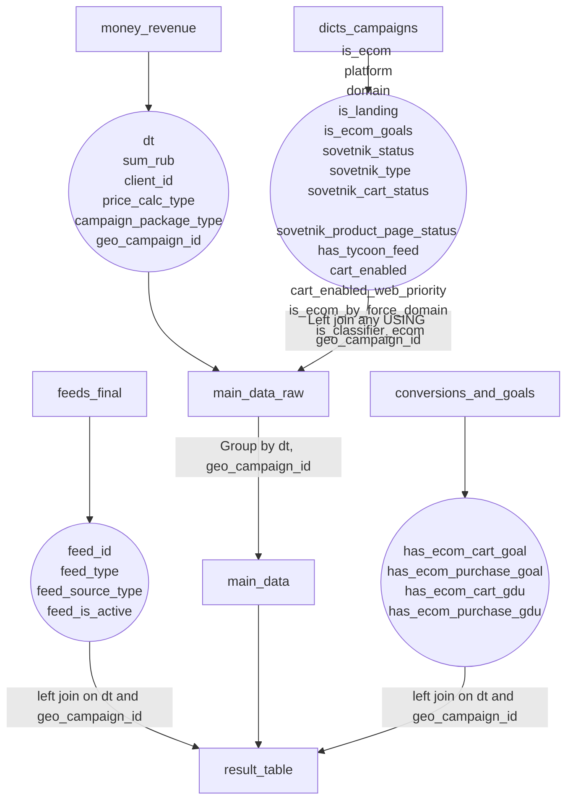

```mermaid
graph TD
    B[money_revenue] -->B1((dt <br/> sum_rub <br/>  client_id <br/>  price_calc_type <br/>  campaign_package_type <br/>  geo_campaign_id)) --> D[main_data_raw]
    C[dicts_campaigns]-->C1((is_ecom <br/> platform <br/> domain <br/> is_landing <br/> is_ecom_goals <br/> sovetnik_status <br/>  sovetnik_type <br/> sovetnik_cart_status <br/> sovetnik_product_page_status <br/> has_tycoon_feed <br/> cart_enabled <br/> cart_enabled_web_priority <br/> is_ecom_by_force_domain <br/> is_classifier_ecom )) -->|Left join any USING geo_campaign_id| D[main_data_raw]
    D[main_data_raw] --> |Group by dt, geo_campaign_id| E[main_data]
    A[feeds_final] --> A1((feed_id <br/> feed_type <br/> feed_source_type <br/> feed_is_active)) -->|left join on dt and geo_campaign_id|F[result_table]
    E[main_data] --> F[result_table]
    G[conversions_and_goals] --> G1((has_ecom_cart_goal <br/> has_ecom_purchase_goal <br/> has_ecom_cart_gdu <br/> has_ecom_purchase_gdu)) -->|left join on dt and geo_campaign_id| F[result_table]
```
